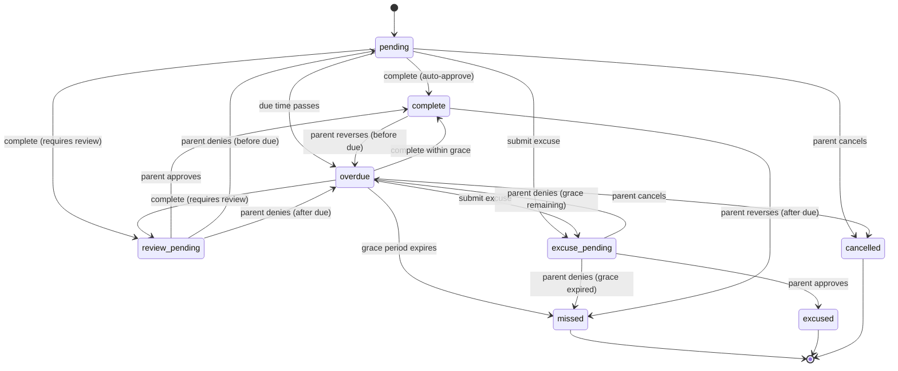

# KidsChores

> A family task & rewards backend for teens (13–17) and their parents — built around one idea:
> **a rewards system for teenagers succeeds or fails on perceived fairness, not gamification polish.**

[](https://github.com/deepexpo/KidsChores_api/actions/workflows/ci.yml)
[](https://kidschores-api.fly.dev/docs)
[](backend/pyproject.toml)
[](backend/app/main.py)

**Live, deployed API:** **https://kidschores-api.fly.dev/docs** — full interactive OpenAPI UI,
try any endpoint against the real running backend (register an account, it's a real database).

---

## What it is

Parents assign tasks — one-time or recurring, each worth points. Teens mark them complete and
earn points into a transparent, append-only wallet, redeemable for real-world rewards. Life
happens — a structured excuse-and-approval flow handles missed tasks without either side feeling
cheated. Tasks can bundle into **series** that pay a bonus only on full completion.

Full product reasoning — personas, business rules, the fairness thesis, the state machine — is in
[`docs/prd.md`](docs/prd.md).

## Why this repo is worth a look

This isn't a CRUD scaffold. A few things that came out of actually building it:

- **The task lifecycle is a formally specified state machine** — 15 transitions
  ([`docs/prd.md §7`](docs/prd.md#7-task-lifecycle-state-machine)), implemented as an explicit
  transition table in [`state_machine.py`](backend/app/services/state_machine.py) with every row
  under test in [`test_state_machine.py`](backend/tests/test_state_machine.py). Anything not in
  the table raises, on purpose — there's no implicit "well, I guess that's also fine" path.
- **The points ledger is append-only and idempotent at the database level, not the application
  level.** A `UNIQUE(task_instance_id, entry_type)` partial index — not a `try/except` — is what
  actually stops a double-tapped "complete" from awarding points twice. See
  [`ledger.py`](backend/app/services/ledger.py) and the design note in
  [`docs/prd.md §8.1`](docs/prd.md#81-point-award-idempotency).
- **Grace-period suspension is real, and it's shared code, not duplicated logic.** When a task
  enters review, its overdue clock pauses so a teen is never penalized for a parent's slow
  response — and the exact same suspended-clock math
  ([`grace_remaining()`](backend/app/services/state_machine.py)) is reused by both the
  interactive review endpoint *and* the nightly batch job that expires overdue tasks. They used to
  disagree; see the bugs section below.
- **It's actually deployed**, not just `docker-compose up`-able — Fly.io, Postgres, Redis, Celery
  beat for scheduled jobs, cost-optimized (scale-to-zero web tier, single always-on worker for the
  scheduler). `fly.toml` and the Dockerfile are in this repo, not hand-waved.
- **61 tests, ruff + mypy --strict clean, on a CI pipeline that actually gates.** Not a `# TODO:
  add tests` placeholder.

### Bugs found by actually running it (not just reading it)

The kind of thing that only shows up once code is exercised for real, not just reviewed:

| Bug | Where | Impact |
|---|---|---|
| Missing `await` on a cross-household authorization check | `wallet.py` manual point adjustment | Silently skipped the check entirely — a parent could adjust another household's member's points |
| No `ON DELETE CASCADE`-safe removal path | `DELETE /v1/household/members/{id}` | Failed with a raw FK violation for any teen with real activity — i.e. almost every teen. Fixed with a soft-delete (`archived_at`), not a cascade, because a cascade would have silently deleted ledger history |
| Ambiguous SQLAlchemy relationship (two FKs to the same table) | `Member` ↔ `TaskInstance`/`LedgerEntry` | The ORM refused to configure at all — nothing using the database could have worked |
| Missing eager-load under async SQLAlchemy | task completion → ledger write | `MissingGreenlet` on the very first real "complete a task" call — the core product loop was broken until this was fixed |
| No household scoping on claim resolution | `POST /v1/wallet/claims/{id}/resolve` | A parent could resolve a reward claim belonging to a *different* household by id |
| Async SQLAlchemy engine reused across event loops | Celery worker, any periodic task's 2nd+ run | A persistent worker process calling `asyncio.run()` per task invocation crashed with "Future attached to a different loop" on the second run of *any* scheduled job — invisible until a job actually ran twice in the same worker's lifetime, which a 15-minute-interval reminder job hits almost immediately |

Every one of these was invisible from reading the code casually. They only surfaced by actually
standing up Postgres + Redis and driving real requests through the state machine end to end.

---

## Architecture



*(Every row in this diagram maps directly to a row in the transition table in
[`state_machine.py`](backend/app/services/state_machine.py) — see
[`docs/prd.md §7.0`](docs/prd.md#70-complete-transition-table) for the authoritative table.)*

## Stack

| Layer | Tech | Notes |
|---|---|---|
| Backend API | FastAPI (Python 3.12), SQLAlchemy 2.0 async | fully async end-to-end, `asyncpg` driver |
| Database | PostgreSQL 16 | partial unique indexes for idempotency; Alembic migrations |
| Job queue | Celery + Redis (Upstash in prod) | nightly instance generation, notification scheduling |
| Push | APNs, token-based Auth Key | 5 notification types (PRD §6.7), config-gated — logs instead of sending if unconfigured |
| Auth | Email + password (argon2id) — Sign in with Apple implemented, deferred client-side | JWT access + rotating single-use refresh tokens |
| Hosting | Fly.io | see [`backend/fly.toml`](backend/fly.toml) |
| iOS client | SwiftUI, iOS 17+ (spec complete, not yet built) | full UI/UX spec in [`docs/ios-prd.md`](docs/ios-prd.md) |

## API surface

Versioned REST under `/v1`. Full contract, every request/response shape, and known client-facing
gaps: [`docs/api-reference.md`](docs/api-reference.md). At a glance:

```
Auth        POST /v1/auth/{register,login,refresh,change-password,apple}
Household   GET/PATCH /v1/household · GET /v1/household/members · verify-pin
Tasks       GET /v1/tasks/{today,week} · complete · excuse · review · cancel
Definitions Full CRUD (archive, not delete) on recurring task templates
Series      Bundled tasks with a completion bonus, two payout modes
Wallet      Balance · ledger · claims (submit/list/resolve) · savings goals
Approvals   Parent inbox — everything awaiting action, oldest first, bulk-actionable
Reports     Weekly completion rate / excuse frequency / points earned, server-aggregated
```

Every mutating task/approval endpoint requires a client-generated idempotency key — a
double-tapped "complete" on a flaky connection replays the original response instead of erroring
or double-awarding points.

---

## Getting started (local dev)

### Prerequisites
- Docker + Docker Compose
- Python 3.12 (editor tooling — the app itself runs in Docker)

### Run it

```bash
git clone https://github.com/deepexpo/KidsChores_api.git
cd KidsChores_api
cp backend/.env.example backend/.env   # fill in JWT_SECRET at minimum

make dev      # postgres + redis + API (:8000) + celery worker
make migrate  # apply Alembic migrations
```

Then visit **http://localhost:8000/docs** for the interactive API, or just hit the
[**live deployment**](https://kidschores-api.fly.dev/docs) instead.

### Tests

```bash
make test        # full suite (61 tests)
make test-state  # state machine only — all 15 PRD §7.0 transitions
make test-ledger  # ledger idempotency, reversals, payout policies
```

---

## Project structure

```
KidsChores_api/
├── backend/
│   ├── app/
│   │   ├── main.py                     # FastAPI app factory, router registration
│   │   ├── config.py                   # Settings (pydantic-settings)
│   │   ├── auth/
│   │   │   ├── jwt.py                  # access/refresh tokens, Apple identity validation
│   │   │   ├── passwords.py            # argon2id hashing
│   │   │   ├── pins.py                 # shared-device PIN hashing (not a security boundary)
│   │   │   └── dependencies.py         # household-isolation auth dependencies
│   │   ├── db/
│   │   │   ├── models.py               # SQLAlchemy models
│   │   │   ├── database.py             # async engine + session
│   │   │   ├── redis.py                # shared Redis client
│   │   │   └── migrations/             # Alembic — 3 migrations, hand-written DDL
│   │   ├── routers/                    # auth, household, tasks, definitions, series,
│   │   │                                # wallet, approvals, reports — one file each
│   │   ├── services/
│   │   │   ├── state_machine.py        # the §7.0 transition table + grace-period math
│   │   │   ├── ledger.py               # append-only ledger writes, idempotency backstop
│   │   │   ├── series_completion.py    # series bonus logic, both payout modes
│   │   │   ├── reports.py              # pure weekly-bucketing aggregation (unit-tested)
│   │   │   ├── idempotency.py          # Redis-backed idempotency-key enforcement
│   │   │   ├── rate_limit.py           # fixed-window rate limiting
│   │   │   └── refresh_tokens.py       # single-use refresh-token rotation
│   │   ├── schemas/schemas.py          # every Pydantic v2 request/response model
│   │   └── workers/                    # Celery: nightly instance generation, parent digest
│   ├── tests/                          # 61 tests — services, not endpoints, mocked at the DB boundary
│   ├── fly.toml                        # Fly deployment config (cost-optimized)
│   └── Dockerfile
├── docs/
│   ├── prd.md                          # master product PRD
│   ├── api-reference.md                # full REST contract for client development
│   ├── auth-endpoints.md               # email/password auth spec + changelog
│   └── ios-prd.md                      # iOS client UI/UX spec (SwiftUI, not yet built)
├── ios/                                 # reserved for the SwiftUI client
└── docker-compose.yml
```

## Key design decisions

**TaskDefinition vs TaskInstance.** The single most important structural decision. Definitions
are templates; instances are immutable historical facts. A definition's `point_value` change never
retroactively touches an instance already generated — `point_value` is frozen on the instance at
creation time.

**Ledger is append-only.** Points never silently change. Reversals write a compensating entry; the
original stays. A teen who watches points vanish without explanation stops trusting the app
permanently — this is a direct product requirement, not an implementation preference.

**Idempotency enforced at the database, not the application.** Both task-completion ledger writes
and series-bonus payouts rely on partial unique indexes, with the application layer catching the
resulting `IntegrityError` and translating it — never the other way around.

**Household isolation lives in the JWT, in one shared dependency.** `household_id` is derived from
the authenticated token and is never accepted as a client parameter, anywhere. Enforced once, in
`get_current_household`, not re-implemented per endpoint.

**On-demand instance generation, not just a nightly batch.** A one-time task, or a recurring task
whose schedule includes today, materializes its instance immediately on creation — reusing the
exact same generation function the nightly job calls, so there's no drift between the two paths.

---

## Roadmap

| Milestone | Status |
|---|---|
| Core backend — household, definitions, instances, state machine, ledger, wallet | ✅ Done |
| Excuse/approval flow, series (both payout modes), claims, reports | ✅ Done |
| Email/password auth, PIN verification, teen account linking, deployed to Fly.io | ✅ Done |
| Push notifications — APNs, all 5 PRD §6.7 types | ✅ Done |
| Sign in with Apple | Implemented server-side, deferred client-side |
| iOS client (SwiftUI) | Spec complete ([`docs/ios-prd.md`](docs/ios-prd.md)), not yet built |
| Savings goals UI, reward menu, teen task proposals | Backend groundwork in place |
